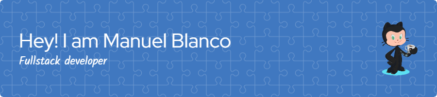

### Hi 👋, my name is Manuel Blanco
#### I am programmer and Full stack developer

I am passionate about programming, I have HTML skills, Css, Bootstrap, Tailwind Css. Javascript, Git and Github, development Full Stack MEAN (Mongodb, Express, Angular and Nodejs).

I seek to work as a team, cooperating with everyone and helping in the best way possible, with great satisfaction in teaching and learning.

Habilidades: 
 
        

- 🌱 Estoy aprendiendo Seguridad Informatica 
- 📫 Cómo contactarme: mandresblac@gmail.com 

        

